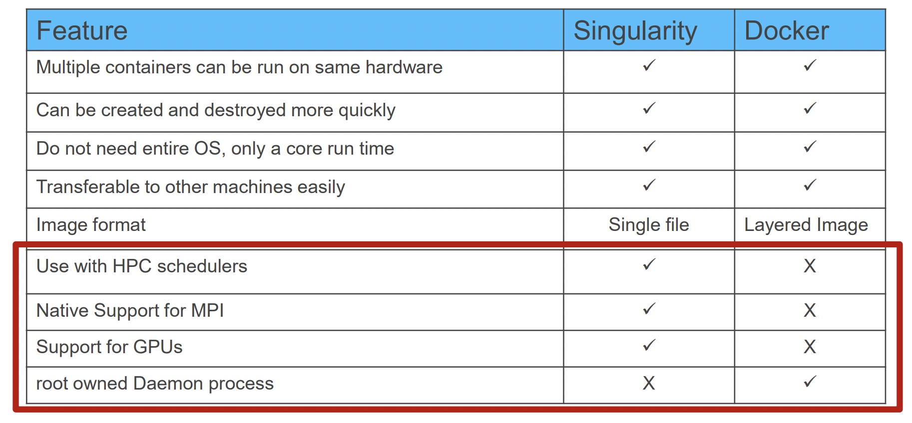

class: myback

```{r setup, include=FALSE}
options(htmltools.dir.version = FALSE)
library(tidyverse)
library(knitr)
```


# Virtualization

.pull-left[
* Virtualization is “the act of creating a virtual (rather than actual) version of something” (Wikipedia)

* So that multiple applications (that have different dependencies) can share the hardware resources on one physical computer

]


.pull-right[

```{r echo=FALSE}
knitr::include_graphics("https://www.netapp.com/media/Screen-Shot-2018-03-20-at-9.24.09-AM_tcm19-56643.png")
```
]

| Virtual Machines | Containers |
|:------:|:----|
| Very flexible, e.g. one can run a Windows guest OS on Linux or vice versa  | Less flexible |
| Heavyweight, need to install all files of a guest OS | Very lightweight, will use the kernel of the host OS |
| Virtualize at the hardware level | Virtualize at the OS level |


---

# Containers

* Containers are packages of software that contain all of the necessary elements to run in any environment. 

* Containers virtualize the operating system and run anywhere, from a private data center to the public cloud or even on a developer’s personal laptop. 

* Containerization allows development teams to move fast, deploy software efficiently, and operate at an unprecedented scale.

* Definition
   * Containers are lightweight packages of your application code together with dependencies such as specific versions of programming language runtimes and libraries required to run your software services.


<span style="font-size:6.0pt">Source: https://cloud.google.com/learn/what-are-containers</span>


---

# Benefits of Containers

* Less overhead
  - Containers require less system resources than traditional or hardware virtual machine environments because they don’t include operating system images.
* Increased portability
  - Applications running in containers can be deployed easily to multiple different operating systems and hardware platforms.
* More consistent operation
  - DevOps teams know applications in containers will run the same, regardless of where they are deployed.
* Greater efficiency
  - Containers allow applications to be more rapidly deployed, patched, or scaled.
* Better application development
  - Containers support agile and DevOps efforts to accelerate development, test, and production cycles.


 <span style="font-size:6.0pt">Source: https://www.netapp.com/devops-solutions/what-are-containers/</span>


---

# Container use cases

* Agile development

  - Containers allow your developers to move much more quickly by avoiding concerns about dependencies and environments.

* Efficient operations

  - Containers are lightweight and allow you to use just the computing resources you need. This lets you run your applications efficiently.

* Run anywhere

  - Containers are able to run virtually anywhere. Wherever you want to run your software, you can use containers.

<span style="font-size:6.0pt">Source: https://cloud.google.com/learn/what-are-containers </span>

---

# What is Docker?

.pull-left[
* open platform for developing, shipping, and running applications
* enables you to separate your applications from your infrastructure so you can deliver software quickly
* Use cases:
   - Fast, consistent delivery of your applications
   - Responsive deployment and scaling
   - Running more workloads on the same hardware
]

.pull-right[
* uses a client-server architecture
   - client talks to the daemon, which does the heavy lifting of building, running, and distributing your containers

```{r echo=FALSE, out.width="100%", fig.align='center'}
knitr::include_graphics("https://docs.docker.com/engine/images/architecture.svg")
```
]

<span style="font-size:6.0pt">Source: https://docs.docker.com/get-started/overview/ </span>


---

# Why Containers in HPC?

* Some applications are very hard to install:
   * Complex dependencies that is cumbersome even for SPACK.
   * Developers are too lazy to test on various architecture and distributions:
       * How many of you use an application that  _works or is tested only on Ubuntu 14.04_?
       * Provide docker images since supporting an application takes time away from doing research.

* Reproducibility is not always guaranteed

* Difficult to share workflows, pipelines and environments with colleagues

<!--
* Can we just use docker?
   * NO. Docker has two major issues with running on HPC systems.
       * Docker requires you to run as root that is not permitted on shared resources such as HPC systems.
       * Docker is not designed to run on HPC systems. It is not designed to run mpi applications across multiple nodes 
-->
  

---

# What is Singularity?

* open-source container software that allows users to pack an application and all of its dependencies into a single image (file)

* "Container for HPC"
  - Assumes that the user does not have root privileges on the host OS
  - Other HPC Container systems:  Charliecloud, Shifter

* Native command line interface
   * Syntax: `singularity <command> <options> <arguments>`

* Can use docker images as well as it's own .sif images.

* Can run mpi applications provided the version of the mpi on the host and the container are the same.


---

# Docker vs Singularity

.pull-left[

```{r echo=FALSE, out.width="50%", fig.align='center'}
knitr::include_graphics("https://www.docker.com/wp-content/uploads/2022/03/Moby-logo.png")
```
]

.pull-right[

```{r echo=FALSE, out.width="50%", fig.align='center'}
knitr::include_graphics("https://sylabs.io/_nuxt/singularity-logo.24b82a06.svg")
```
]


| Docker | Singularity |
|:----------:|:-----------|
| Assumes that the user has root privileges in the production environment | Assumes that the user **does not have root** privileges in the production environment |
| Designed for system services | Designed for HPC use cases |


---

# Docker vs Singularity

```{r echo=F, out.width="85%", fig.align='center'}

```

<span style="font-size:6.0pt">Source: https://on-demand.gputechconf.com/gtc/2018/presentation/s8368-containerizing-deep-learning-with-singularity.pdf</span>


---

# VMs vs Docker vs Singularity

```{r echo=F, out.width="85%", fig.align='center'}
knitr::include_graphics("https://tin6150.github.io/psg/fig/vm_vs_container.png")
```

<span style="font-size:6.0pt">Source: Greg Kurtzer keynote at HPC Advisory Council 2017 @ Stanford</span>


---

# Singularity Basics

*  Command Line syntax:
  ```{bash eval=F}
  singularity <command> <options> <arguments>
  ```

* To get help information for a specific command:
  ```{bash eval=F}
  singularity <command> --help
  ```

* Privilege Escalation
  * If you do not have root privileges outside the container, you do not have them inside the container either.
  * Need to build images on your local computer (where you have root privileges)


---

# Singularity Workflow

* Build Singularity images on the local machine
  - Root privilege is needed
* Upload images onto the HPC cluster
* Run containers on the HPC cluster
  - Root privilege is NOT needed

```{r echo=FALSE, out.width="100%", fig.align='center'}
knitr::include_graphics("https://apptainer.org/user-docs/2.6/_images/flow.png")
```

---

# Installing Singularity
* On Linux
  - Install binary (recommended)
     * Use either apt-get or rpm/yum or zypper

  -  Install from source
     * https://github.com/sylabs/singularity

* On Windows
  - Install a Linux VM or WSL first

* On Mac
  - Install a Linux VM or Vagrant first


---

# Download images from URI

* You can pull images from docker hub or another URI instead of building images

```{bash eval=F}
[2021-03-11 21:22.53] ~/Workshop/singularity
[apacheco@mira](1001): ls
singularity.cast
[2021-03-11 21:22.54] ~/Workshop/singularity
[apacheco@mira](1002): singularity pull docker://godlovedc/lolcow
INFO:    Converting OCI blobs to SIF format
INFO:    Starting build...
Getting image source signatures
Copying blob 9fb6c798fa41 done
Copying blob 3b61febd4aef done
Copying blob 9d99b9777eb0 done
Copying blob d010c8cf75d7 done
Copying blob 7fac07fb303e done
Copying blob 8e860504ff1e done
Copying config 73d5b1025f done
Writing manifest to image destination
Storing signatures
INFO:    Creating SIF file...
[2021-03-11 21:23.24] ~/Workshop/singularity
[apacheco@mira](1003): ls
lolcow_latest.sif  singularity.cast
```


---

# Building images

* Use the `build` command to build Singularity images
  * Need root privileges
*  Syntax:
  ```{bash eval=F}
  singularity build [build options…] <image file path> <BUILD TARGET>
  ```
* Build a Ubuntu 20.04 LTS  image:
  ```{bash eval=F}
  sudo singularity build ubuntu.sif docker://ubuntu:20.04
  ```
* The `BUILD TARGET` defines the method how an image is built
  - A URI to a base OS/container image
     * Docker Hub images begins with docker://
     * Singularity Hub images begins with shub://
  - Path to a Singularity sandbox 
  - Path to a Singularity recipe (definition file)
     * More on this later


---

# Build a sandbox for modifying image

* By default, a compressed, read-only image will be built
* The `--sandbox` option builds a sandbox to which changes can be made
* To make changes to the sandbox, use the singularity shell command with the `--writable` option
     * Manage files and directories
     * Install packages/dependencies
* Example
  - Build a Ubuntu 20.04 sandboxed image
     ```{bash eval=F}
     sudo singularity build --sandbox ubuntu docker://ubuntu:20.04
     ```
  - Start a writable shell in the Ubuntu sandboxed image
     ```{bash eval=F}
     sudo singularity shell --writable ubuntu
     ```


---

# Build your own images

* The preferred method to build singularity images is by creating a definition file (similar to Dockerfile for docker images)
   * The method on the previous slide (pull image, create sandbox, install packages, create final image) is 
	 * tedious to reproduce
         * cannot set environment and other features that improve usability
* A Singularity Definition file is divided into two parts
* Header: describes the core operating system to build within the container.
   * configure the base operating system features needed. 
   * specify, the Linux distribution, the specific version, and the packages that must be part of the core install 
* Sections: rest of the definition is comprised of sections
   * Each section is defined by a `%` character followed by the name of the particular section
   * sections are optional, and a def file may contain more than one instance of a given section

---

# Definition file: Header

* The header should be written at the top of the def file. 
* It tells Singularity about the base OS used to build the container.
* `Bootstrap` (required): determines the bootstrap agent to create the base OS
   - docker (images hosted on Docker Hub)
   - localimage (images saved on your machine)
   - docker-daemon (images managed by the locally running docker daemon)
   - yum/zypper/debootstrap (yum/zypper based systems such as CentOS/OpenSUSE/Debian,Ubuntu)
* Depending on the value assigned to `Bootstrap`, other keywords may also be valid in the header

```{bash eval=F}
Bootstrap: docker
From: debian:7

Bootstrap: localimage
From: /path/to/container/file/or/directory

Bootstrap: docker-daemon
From: debian:latest

Bootstrap: yum
OSVersion: 7
MirrorURL: http://mirror.centos.org/centos-%{OSVERSION}/%{OSVERSION}/os/$basearch/
Include: yum
```


---

# Getting Base OS/Container Images

* Repositories

   - Docker hub: https://hub.docker.com/

   - NVIDIA GPU Cloud: https://ngc.nvidia.com
 
   - QUAY: https://quay.io

   - Distribution repo
  
        * YUM/RHEL
  
        * Debian/Ubuntu


* See `singularity build --help`
   

---


# Definition file: Section

* sections add different content or execute commands at different times during the build process
* Common sections
   * `%setup`: commands in the %setup section are first executed on the host system outside of the container after the base OS has been installed 
   * `%files` : copy files into the container with greater safety than using the %setup section
   * `%post`: commmands to be executed on the container image for e.g. download files from the internet, install new software and libraries, write configuration files, create new directories, etc.
   * `%environment`: define environment variables that will be set at runtime
   * `%runscript`: command to be executed when the container image is run
   * `%labels`: add metadata to your container
   * `%help`: add metadata to display message  using the `run-help` command 
   * `%app*`: if you build multiple applications within the same container, you can create run, help and env sections for individual apps 

---

# Example


```{bash echo=T, eval=F}
Bootstrap: docker
From: rockylinux:latest

%help
  Python 3.8 in a Rocky Linux container

%labels
  Author: Alex Pacheco
  Contact: hpc@lehigh.edu

%runscript
  exec python3 "$@"

%post
  yum install -y python38

```

```{bash eval=F}
sudo singularity build rocky.sif rocky.def
INFO:    Starting build...
Getting image source signatures
Copying blob 1a930d163dca skipped: already exists
Copying config 211bb129b4 done
Writing manifest to image destination
Storing signatures
2022/03/30 15:35:51  info unpack layer: sha256:1a930d163dcafa193dc2c3c005d9c220ae1c07a48cad5f7feed0066ada0b998f
INFO:    Running post scriptlet
+ yum install -y python38
Rocky Linux 8 - AppStream                                                                                                                                                   8.4 MB/s | 9.7 MB     00:01
... snip ...
Installed:
  python38-3.8.8-4.module+el8.5.0+672+ab6eb015.x86_64              python38-libs-3.8.8-4.module+el8.5.0+672+ab6eb015.x86_64          python38-pip-19.3.1-4.module+el8.5.0+672+ab6eb015.noarch
  python38-pip-wheel-19.3.1-4.module+el8.5.0+672+ab6eb015.noarch   python38-setuptools-41.6.0-5.module+el8.5.0+672+ab6eb015.noarch   python38-setuptools-wheel-41.6.0-5.module+el8.5.0+672+ab6eb015.noarch

Complete!
INFO:    Adding help info
INFO:    Adding labels
INFO:    Adding runscript
INFO:    Creating SIF file...
INFO:    Build complete: rocky.sif
```

---

# Singularity: modify existing images

* Singularity can build a sandboxed image so that you can install new packages or modify installed packages
   * You need admin right for this and should be done on a system where you have admin rights
       * No, you cannot get admin rights on Sol/Hawk.
       * You can install singularity natively on linux

```{bash eval=F}
[2021-03-11 21:23.50] ~/Workshop/singularity
[apacheco@mira](1007): singularity exec lolcow_latest.sif which python
[2021-03-11 21:24.41] ~/Workshop/singularity
[apacheco@mira](1010): sudo singularity build -s lolcow lolcow_latest.sif
INFO:    Starting build...
INFO:    Creating sandbox directory...
INFO:    Build complete: lolcow
[2021-03-11 21:24.52] ~/Workshop/singularity
[apacheco@mira](1011): sudo singularity shell -w lolcow
... skip ..
[2021-03-11 21:25.34] ~/Workshop/singularity
[apacheco@mira](1012): sudo singularity build lolcow.sif lolcow
INFO:    Starting build...
INFO:    Creating SIF file...
INFO:    Build complete: lolcow.sif
[2021-03-11 21:26.05] ~/Workshop/singularity
[apacheco@mira](1015): singularity exec lolcow.sif which python
/usr/bin/python
```


---

# Singularity on Sol and Hawk

* Singularity is installed on all compute nodes of Sol and Hawk.
    * There is no module file for singularity

* Singularity containers available for
    * Virtual Desktop Environment on Open OnDemand
    * RStudio Server on Open OnDemand
    * Cactus uses singularity to run docker image 
    
* Want to use your image:
    * You need to build on your local system and copy the .sif file to Sol 


---

# Running containerized applications

* `singularity run image`: will run the default executing script
   * similar to `docker run images` 

```{bash eval=F}
[2021-03-11 21:23.27] ~/Workshop/singularity
[apacheco@mira](1004): singularity run lolcow_latest.sif
 _______________________________________
/ Don't go around saying the world owes \
| you a living. The world owes you      |
| nothing. It was here first.           |
|                                       |
\ -- Mark Twain                         /
 ---------------------------------------
        \   ^__^
         \  (oo)\_______
            (__)\       )\/\
                ||----w |
                ||     ||
```


---

# Execute a command within the container 

* `singularity exec image command`: execute command from within the container

```{bash eval=F}
[2021-03-11 21:23.39] ~/Workshop/singularity
[apacheco@mira](1006): singularity exec lolcow_latest.sif cat /etc/os-release
NAME="Ubuntu"
VERSION="16.04.3 LTS (Xenial Xerus)"
ID=ubuntu
ID_LIKE=debian
PRETTY_NAME="Ubuntu 16.04.3 LTS"
VERSION_ID="16.04"
HOME_URL="http://www.ubuntu.com/"
SUPPORT_URL="http://help.ubuntu.com/"
BUG_REPORT_URL="http://bugs.launchpad.net/ubuntu/"
VERSION_CODENAME=xenial
UBUNTU_CODENAME=xenial
```


---

# Run container as an executable

* `./containername`: run the conatiner as an executable, 
    * executes the default runscript
    * executes ENTRYPOINT CMD for docker images

```{bash eval=F}
[2021-03-11 21:23.35] ~/Workshop/singularity
[apacheco@mira](1005): ./lolcow_latest.sif
 _________________________________
< So you're back... about time... >
 ---------------------------------
        \   ^__^
         \  (oo)\_______
            (__)\       )\/\
                ||----w |
                ||     ||
```

---

# Start a shell

* `singularity shell image`: will start a shell within the container for interactive use

```{bash eval=F}
[2022-03-30 16:07.41] ~/Workshop/singularity
[apacheco@mira](1060): singularity shell lolcow_latest.sif
Singularity> cat /etc/os-release
NAME="Ubuntu"
VERSION="16.04.3 LTS (Xenial Xerus)"
ID=ubuntu
ID_LIKE=debian
PRETTY_NAME="Ubuntu 16.04.3 LTS"
VERSION_ID="16.04"
HOME_URL="http://www.ubuntu.com/"
SUPPORT_URL="http://help.ubuntu.com/"
BUG_REPORT_URL="http://bugs.launchpad.net/ubuntu/"
VERSION_CODENAME=xenial
UBUNTU_CODENAME=xenial
Singularity>
```


---

# Frequently used options 

* `-B` or `--bind`: bind a host directory to the container
   - home is automatically bound
     ```{bash eval=F}
     [2022-03-30 16:36.08] /share/Apps/virtualapps/centos8
     [alp514.hawk-a221](1003): singularity exec xfce8.sif ls /share 
     ls: cannot access '/share': No such file or directory
     [2022-03-30 16:36.19] /share/Apps/virtualapps/centos8
     [alp514.hawk-a221](1004): singularity exec -B /share:/share xfce8.sif ls /share
     Apps  ceph
     ```
   - can be called multiple times

* `--nv`: enable NVIDIA GPU support
   - requires working installation of the NVIDIA GPU driver on the host, and a matching version of the basic NVIDIA/CUDA libraries


---

# Singularity: pull, modify and run

<script id="asciicast-zbtQSoIeSF9RsTspXGwrpqEfW" src="https://asciinema.org/a/zbtQSoIeSF9RsTspXGwrpqEfW.js" async data-speed=3 data-rows=25></script>

[View online](https://asciinema.org/a/zbtQSoIeSF9RsTspXGwrpqEfW?autoplay=1&speed=2&size=8)


---

# Bootstrap from docker 


<script id="asciicast-VPK8WcJwnnKKqQRid2NcViEjI" src="https://asciinema.org/a/VPK8WcJwnnKKqQRid2NcViEjI.js" async data-speed=2 data-rows=25></script>

[View online](https://asciinema.org/a/?VPK8WcJwnnKKqQRid2NcViEjI?autoplay=1&speed=2&size=8)


---

# Bootstrap from local image


<script id="asciicast-5NLTcp0puDC1L27r2HN47WanG" src="https://asciinema.org/a/5NLTcp0puDC1L27r2HN47WanG.js" async data-speed=2 data-rows=25></script>

[View online](https://asciinema.org/a/5NLTcp0puDC1L27r2HN47WanG?autoplay=1&speed=2&size=8)


---

# Best Practices

* Bootstrap from trusted sources
    * preferably use base image from docker hub provided by OS vendor.
    * avoid using an image from some random source.
    * if you need to use a random source, review the dockerfile, definition file etc first.

* Try to reuse existing images
    * See my rstudio images. (https://github.com/alexpacheco/lurc-ood-rstudio)
       * build base image with minimal packages ->
       * image with dependencies for installing a set of basic R packages ->
       * image with R packages for bioinformatics or geospatial

* If possible, build docker images, upload to docker hub and bootstrap docker images (https://hub.docker.com/repository/docker/alexpacheco/rstudio)
    * docker builds images in layers and it is easier to build a singularity image by downloading various layers. 

 
---
class: inverse, middle


# Questions?


